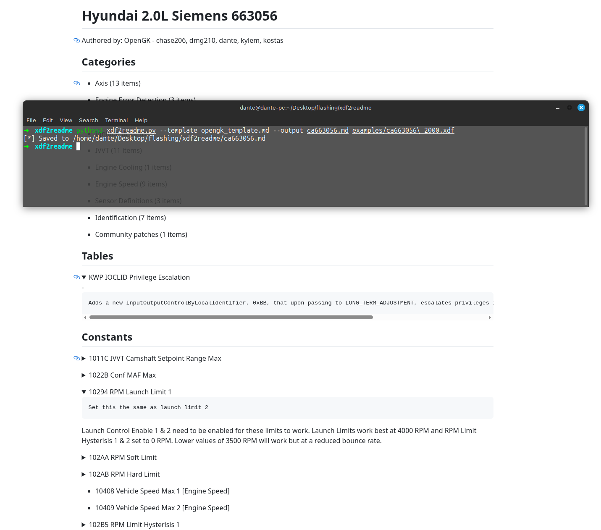

# XDF2README

Generate simple summary files from TunerPro definitions. 
Perfect for showcasing what does the definition contain, without forcing the user
to open TunerPro or go through the XML.
Uses and ships with a Markdown template, but Jinja2 template engine is used, so it can be heavily modified. 



## Installation

```git clone https://github.com/dante383/xdf2readme```

## Usage

```python3 xdf2readme.py --template templates/opengk_template.md --output ca663056.md examples/ca663056.xdl```

